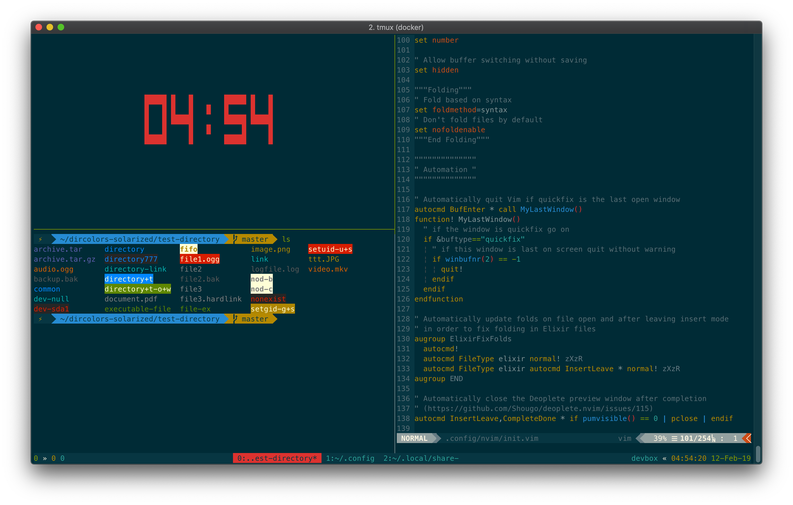
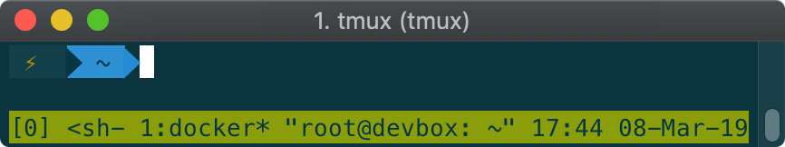
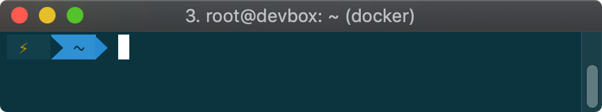

# Devbox
My personal development machine inside [Docker](https://www.docker.com/).

## Screenshot


## Features
- [Tmux](https://github.com/tmux/tmux) for terminal multiplexing
- [Zsh](http://zsh.sourceforge.net/)
  - [Oh-My-Zsh](https://github.com/robbyrussell/oh-my-zsh) installed for Zsh management
- [ASDF VM](https://github.com/asdf-vm/asdf) for managing multiple runtimes
- [NeoVim](https://neovim.io/) with my custom configuration
- [Fuck](https://github.com/nvbn/thefuck) for easily correcting commands
- Colors and themes:
    - [Agnoster Zsh theme](https://github.com/agnoster/agnoster-zsh-theme)
    - [Solarized dark dircolors](https://github.com/seebi/dircolors-solarized)
    - [Solarized dark Vim Airline theme](https://github.com/vim-airline/vim-airline-themes)
    - [Tmux theme](https://github.com/jimeh/tmux-themepack) 
- Languages:
  - Python 2 and 3 available via `python2` and `python3` respectively
  - [Erlang/OTP 21.2.5](https://www.erlang.org/) installed via ASDF
  - [Elixir 1.8.1](https://elixir-lang.org/) installed via ASDF
- Other tools:
  - [Elixir-LS language server](https://github.com/elixir-lsp/elixir-ls) for use with NeoVim.

## Builds
The image is automatically built to [Docker Hub here](https://hub.docker.com/r/jswny/devbox) from each commit on the master branch. Thus, the only tag on the image is `latest`. So, when you pull the image, you will pull the image which was built from the latest commit to master.

## Usage
### Docker Image
The Docker image is available from the [Docker Hub](https://hub.docker.com/r/jswny/devbox). A new image is pushed to the `jswny/devbox:latest` tag each time a new commit is pushed to the `master` branch of the [GitHub repository](https://github.com/jswny/devbox).

The image is based on [Ubuntu `18.04`](https://hub.docker.com/_/ubuntu).

### Getting the Image
To run the image, you can either clone this repository and build the image from source (which will take about 10-15 minutes), or, you can pull it and run it from Docker Hub. See below for instructions for each option.

#### Building from Source
To build the image from source, first clone this repository, then build it using Docker.
```sh
$ git clone https://github.com/jswny/devbox
$ cd devbox
$ docker build -t jswny/devbox .
```

#### Pulling from Docker Hub
If you want to pull the prebuilt image from Docker Hub instead of building it yourself, all you have to do is pull it using Docker.
```sh
$ docker pull jswny/devbox
```
If you use `docker run` (as shown below), Docker will pull the image automatically. However, you may want to pull it manually if you don't want to run it right away or if you want to force the image to update from Docker Hub.

### Running the Image
Once you have the image either built from source or pulled from Docker Hub, you can run it using Docker
```sh
$ docker run -it -h devbox --name devbox jswny/devbox
```
This command sets the internal hostname of the container as `devbox` using the `-h` flag.

You can also run the container so that it automatically removes itself after it stops running with the `--rm` flag. Keep in mind that this may cause you to lose any data from inside the container.
```sh
$ docker run -it --rm -h devbox --name devbox jswny/devbox
```

You may also want to run the container without a name, or without a hostname, so that you can run many container instances of this image. To do so, remove those commands like so:
```sh
$ docker run -it jswny/devbox
```

### Volumes
You can use a [Docker volume](https://docs.docker.com/storage/volumes/) to mount local files into the internal filesystem of the container so that you can access them inside the container. Any changes you make to the files in the volume inside the container will be reflected outside the container, and vice versa.

To mount a volume when running the container, add the `-v /local/path/:/internal/container/path` flag when running the container.

```sh
$ docker run -it --rm -v /local/path/:/internal/container/path -h devbox --name devbox jswny/devbox
```

### Stop the Container
```sh
$ docker stop devbox
```

### Remove a Stopped Container
```sh
$ docker rm devbox
```

### Remove the Image
```sh
$ docker rmi jswny/devbox
```

## Host Terminal Configuration
Devbox is optimized for the [Solarized Dark](https://ethanschoonover.com/solarized/) colorscheme.

In addition, the shell prompt that is configured requires a **Powerline patched font** to display certain things. You can find and install Powerline patched fonts through [this Powerline repository](https://github.com/powerline/fonts).

You may need to tell your terminal to do the following (play around with these if the text doesn't look right):
1. Draw bold text in bold font
2. Draw bold text in bright colors

I recommend the following (this is my setup):
- macOS
- [iTerm 2](https://www.iterm2.com/)
  - Bold text drawn in bold font
- [Solarized dark](https://ethanschoonover.com/solarized/) terminal colors
- [Meslo LG M DZ Powerline patched font](https://github.com/powerline/fonts)

## Configuration
Configuration files live in the `dotfiles` directory in this repository. Devbox attempts to follow the [XDG Specification](https://specifications.freedesktop.org/basedir-spec/basedir-spec-0.6.html) wherever possible.

Currently, the following configuration files are provided:
- `.config/zsh/.zshrc` for [Zsh](http://zsh.sourceforge.net/)
- `.config/nvim/init.vim` for [NeoVim](https://neovim.io/) (similar to `.vimrc` for Vim)
- `zshenv` to configure Zsh to use [XDG](https://specifications.freedesktop.org/basedir-spec/basedir-spec-0.6.html) and set environment variables accordingly. These need to be set prior to sourcing `.zshrc` because the `.zshrc` file is located inside the XDG config directory.
- `.config/tmux/tmux.conf` for [Tmux](https://github.com/tmux/tmux)

## Known Issues
- When running Devbox inside Tmux from the host, Zsh does not render the prompt spacing correctly, so the Agnoster prompt will not have a space before typing like it should have.
  - With Tmux:
  
  - Without Tmux:
  

## TODO
- Use environment variables in `Dockerfile`
- Use XDG for ASDF (should be `$XDG_DATA_HOME/asdf`)
- Fix duplicate `.zcompdump*` files (one in `$ZDOTDIR` and one in `$XDG_CACHE_HOME/zsh`)
- Fix `.zcompdump*` files missing `$SHORT_HOST` in their file names
- Install Elixir-LS for use with NeoVim LS plugin
- Install Elixir and Erlang from source so that Elixir-LS can jump to source
- Support Phoenix Development (probably requires configuring ports with Docker)
- Look into [coc.nvim](https://github.com/neoclide/coc.nvim) to replace LanguageClient-NeoVim (potentially)
- Fix snippet support in NeoVim with Elixir (etc.)
- Figure out how to use SSH keys
- Find some way to use Tmux with the XDG config file in `$XDG_CONFIG_HOME/tmux/tmux.conf`
- Use [Lightline](https://github.com/itchyny/lightline.vim) instead of Airline for NeoVim
- Readme info on how to restart a stopped container
- Readme info on how to `exec` into background container